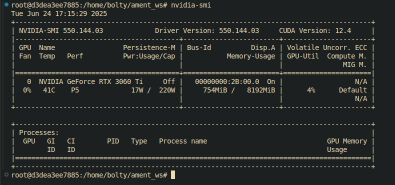
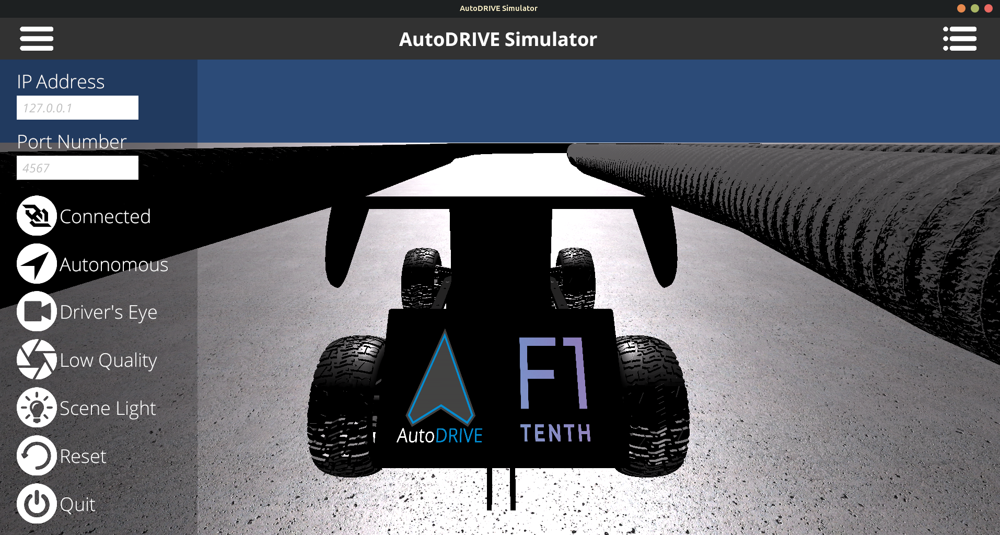
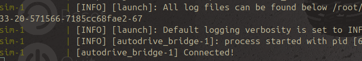

# WATonomous F1Tenth

## linux Setup for AutoDRIVE F1Tenth Simulator

to get setup and start developing on the AutoDRIVE sim, you will need to following do the following: 
1. Have Docker Installed on the host system
2. Have the Nvidea container toolkit installed
3. setup the wato_f1teenth workspace
4. Download the Autodrive sim 

## Installing Docker

Installing Docker is pretty intuitive, However it is not recomended that you install it using your package manager such as apt or dnf. its is recomended that your go the docker website and follow the instruction for your own distro 

[link to docker install page](https://docs.docker.com/engine/install/)


## Installing the Nvidia Container toolkit (OPTIONAL) 

If you have an Nvidia gpu it is highly recomended that you install the Nvidia Container toolkit, as some of the algorithms need it to run properly such as the current implementation of our particle filter. 

before you install the Nvidia Container toolkit, ensure that your Nvidia drivers are installed correctly. you can run the following comand to figure it out: 
```
nvidia-smi
```
if the drivers are installed properly, you should see an output simmilar to this with your gpu: 
```
Tue Jan 13 17:55:31 2026
+-----------------------------------------------------------------------------------------+
| NVIDIA-SMI 590.48.01              Driver Version: 591.59         CUDA Version: 13.1     |
+-----------------------------------------+------------------------+----------------------+
| GPU  Name                 Persistence-M | Bus-Id          Disp.A | Volatile Uncorr. ECC |
| Fan  Temp   Perf          Pwr:Usage/Cap |           Memory-Usage | GPU-Util  Compute M. |
|                                         |                        |               MIG M. |
|=========================================+========================+======================|
|   0  NVIDIA GeForce RTX 5070 ...    On  |   00000000:02:00.0 Off |                  N/A |
| N/A   35C    P2             12W /   60W |       0MiB /   8151MiB |      0%      Default |
|                                         |                        |                  N/A |
+-----------------------------------------+------------------------+----------------------+

+-----------------------------------------------------------------------------------------+
| Processes:                                                                              |
|  GPU   GI   CI              PID   Type   Process name                        GPU Memory |
|        ID   ID                                                               Usage      |
|=========================================================================================|
|  No running processes found                                                             |
+-----------------------------------------------------------------------------------------+
```
if you don't see something like this, that means that your drivers are not installed properly, and you need to go install them. 

you can use the following docs provided by Nvidia or any yt tutorial of your choice to get the job done. [link to driver install](https://docs.nvidia.com/datacenter/tesla/driver-installation-guide/index.html) 

Given you have installed your driver and can see an output similar to the one I got you can go do the following if you are on an ubuntu based system: 

1. Configure the production repository: 
```
curl -fsSL https://nvidia.github.io/libnvidia-container/gpgkey | sudo gpg --dearmor -o /usr/share/keyrings/nvidia-container-toolkit-keyring.gpg \
  && curl -s -L https://nvidia.github.io/libnvidia-container/stable/deb/nvidia-container-toolkit.list | \
    sed 's#deb https://#deb [signed-by=/usr/share/keyrings/nvidia-container-toolkit-keyring.gpg] https://#g' | \
    sudo tee /etc/apt/sources.list.d/nvidia-container-toolkit.list
```

2. Update the packages list from the repository : 
```
sudo apt-get update
```
3. Install the NVIDIA Container Toolkit packages
```
export NVIDIA_CONTAINER_TOOLKIT_VERSION=1.17.8-1
  sudo apt-get install -y \
      nvidia-container-toolkit=${NVIDIA_CONTAINER_TOOLKIT_VERSION} \
      nvidia-container-toolkit-base=${NVIDIA_CONTAINER_TOOLKIT_VERSION} \
      libnvidia-container-tools=${NVIDIA_CONTAINER_TOOLKIT_VERSION} \
      libnvidia-container1=${NVIDIA_CONTAINER_TOOLKIT_VERSION}
```
5. Configure the container runtime by using the ```nvidia-ctk``` command
```
sudo nvidia-ctk runtime configure --runtime=docker
```
6. Restart the Docker daemon using the following or by restarting your system 
```
sudo systemctl restart docker
```

if you were not on an ubuntu based system, the first 3 comands can varray, so go the the actual [docs](https://docs.nvidia.com/datacenter/cloud-native/container-toolkit/latest/install-guide.html).

to check that everything is working properly, lauch up the container using ```./watod build && ./watod up``` and run the ```nvidia-smi``` inside of the container. you should get a similar output like before: 


## Setup the Wato F1teenth Workspace

1. In your home directory (~), run: `mkdir ros_ws && cd ros_ws`, then run
`git clone https://github.com/WATonomous/wato_f1tenth.git`
2. Go into the repo: `cd wato_f1tenth`
3. Start VSCode: `code .`
4. Make sure the `watod-config.sh` file has: `ACTIVE_MODULES="vis_tools robot sim"` and `MODE_OF_OPERATION="develop"`. 
5. Run `./watod build && ./watod up` to start the containers. Future starts can just be `./watod up` if you don't need to rebuild containers. **(if you would like to run gui apps in the container, run `xhost + local:root` before starting the container)**
6. Download the Docker extension for VSCode. 
7. From the extension pannel, right click on the `-robot_dev-1` container and attach a VSCode.
8. In the opened VSCode window select the `/home/bolty/ament_ws` folder. This will be where you do your development!

## Download the Autodrive sim 

1. Download the `practice` simulator under Local Resources from: https://github.com/AutoDRIVE-Ecosystem/AutoDRIVE-RoboRacer-Sim-Racing/releases/tag/2026-icra 
2. Unzip the download and move the `autodrive_simulator` to the ros_ws
3. then `cd autodrive_simulator` and rename the file `AutoDRIVE Simulator.x86_64` to `sim.x86_64`
4. run `chmod + sim.x86_64` to make it excutable then run `./sim.x86_64` to open the sim
5. Press on the button "Disconnected" to attempt connection to your running watod containers. The default port should already be 4567.
6. You should see "Connected"- this means your physics simulator is connected to your watod containers and everything is setup correctly!


7. There is built-in Keyboard Teleop in the simulator. Click on "Autonomous" to set driving mode to "Manual", you will be able to drive with WASD.

